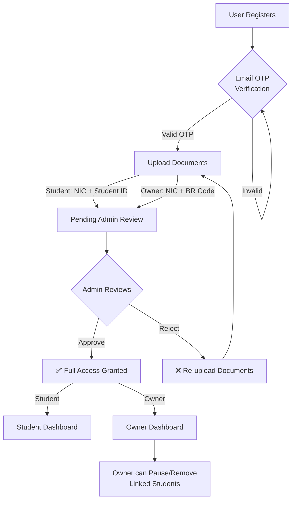

# User Onboarding & Approval Workflows — Implementation Plan

## Overview

This plan implements a secure, multi-step verification system for both **Property Owners** and **Students**, with an **Admin Review Panel** to approve or reject accounts, and **Owner Management Controls** over linked students.

Currently, users register and immediately get full access. After this change, all users must go through document verification and admin approval before gaining platform access.

---

## User Review Required

> [!IMPORTANT]
> **Email/OTP Service**: We need a way to send OTP codes. The plan uses **Nodemailer with Gmail SMTP** (free, no third-party signup needed). You'll need to generate a Gmail "App Password" for this. Is this acceptable, or do you prefer another service (e.g., SendGrid, Resend)?

> [!WARNING]
> **Breaking Change for Existing Users**: All existing users in the database currently have no verification status. We'll run a migration to mark existing users as `verified` so they aren't locked out. New registrations will go through the full verification flow.

---

## Proposed Changes

### Database Schema

#### [MODIFY] [`initDb.js`](file:///z:/root/boarding_finder-main/backend/config/initDb.js)

Add new columns to the `users` table:

```sql
-- Email/OTP verification
is_email_verified    BOOLEAN DEFAULT FALSE,
email_otp            VARCHAR(6),
email_otp_expires    TIMESTAMP,

-- Account verification status (both owners & students)
verification_status  VARCHAR(20) DEFAULT 'pending'
                     CHECK (verification_status IN ('pending', 'verified', 'rejected', 'suspended')),
verification_docs    TEXT[],          -- URLs of uploaded NIC/BR/Student ID images
verification_note    TEXT,            -- Admin note on rejection reason
verified_at          TIMESTAMP,
verified_by          INTEGER REFERENCES users(id),

-- Owner management: allows owner to pause/suspend a student
account_status       VARCHAR(20) DEFAULT 'active'
                     CHECK (account_status IN ('active', 'paused', 'removed')),
status_changed_by    INTEGER REFERENCES users(id),
status_changed_at    TIMESTAMP
```

Also update the role CHECK constraint to include `'admin'`.

#### [MODIFY] [`database.sql`](file:///z:/root/boarding_finder-main/backend/database.sql)
Mirror the same schema changes for the reference SQL file.

---

### Backend — New Dependencies

#### [MODIFY] [`package.json`](file:///z:/root/boarding_finder-main/backend/package.json)
```
npm install nodemailer
```

---

### Backend — Email Utility

#### [NEW] `backend/utils/sendOtp.js`
- Configures Nodemailer with Gmail SMTP using env vars (`SMTP_EMAIL`, `SMTP_PASSWORD`)
- Exports a `sendOtp(email, otpCode)` function that sends a styled HTML email with the 6-digit code
- OTP expires in 10 minutes

---

### Backend — Auth Controller Changes

#### [MODIFY] [`registerStudent.js`](file:///z:/root/boarding_finder-main/backend/controllers/auth/registerStudent.js)
Changes:
- Set `is_email_verified = false`, `verification_status = 'pending'`
- Generate a 6-digit OTP, save it to `email_otp` + `email_otp_expires`
- Send the OTP to the user's email via `sendOtp()`
- Return the token but include `verification_status: 'pending'` in the response so the frontend knows to redirect to the OTP page

#### [MODIFY] [`registerOwner.js`](file:///z:/root/boarding_finder-main/backend/controllers/auth/registerOwner.js)
Same changes as student registration.

#### [MODIFY] [`login.js`](file:///z:/root/boarding_finder-main/backend/controllers/auth/login.js)
Changes:
- After successful password check, include `verification_status` and `account_status` in the response
- If `account_status === 'paused'` → return 403 with message "Your account has been paused by the property owner"
- If `account_status === 'removed'` → return 403 with message "Your account has been removed"
- Allow login even if not yet verified (so user can access the verification/document upload pages), but include the status so the frontend can gate access

#### [MODIFY] [`me.js`](file:///z:/root/boarding_finder-main/backend/controllers/auth/me.js)
- Include `verification_status`, `account_status`, `is_email_verified`, and `verification_docs` in the response

---

### Backend — New Verification Routes

#### [NEW] `backend/controllers/auth/verifyOtp.js`
- `POST /api/auth/verify-otp` — accepts `{ otp }` from the authenticated user
- Validates the OTP against `email_otp` and checks `email_otp_expires`
- On success: sets `is_email_verified = true`, clears the OTP fields
- Returns updated user object

#### [NEW] `backend/controllers/auth/resendOtp.js`
- `POST /api/auth/resend-otp` — generates a new OTP, updates DB, sends email
- Rate-limited to 1 resend per 60 seconds

#### [NEW] `backend/controllers/auth/uploadVerificationDocs.js`
- `POST /api/auth/upload-verification-docs` — accepts file uploads via Multer
- **For Students**: expects NIC photo + Student ID photo (2 files)
- **For Owners**: expects NIC photo + Business Registration document (2 files)
- Saves files to `backend/uploads/verification/` directory
- Updates `verification_docs` array in the database
- Sets `verification_status = 'pending'` (if not already)

#### [MODIFY] [`auth.js` (routes)](file:///z:/root/boarding_finder-main/backend/routes/auth.js)
Add the new routes:
```javascript
router.post("/verify-otp", auth, verifyOtp);
router.post("/resend-otp", auth, resendOtp);
router.post("/upload-verification-docs", auth, multerUpload, uploadVerificationDocs);
```

---

### Backend — Admin Verification Routes

#### [NEW] `backend/routes/admin.js`
#### [NEW] `backend/controllers/admin/getPendingUsers.js`
- `GET /api/admin/pending-users` — returns all users where `verification_status = 'pending'` AND `verification_docs` is not empty (i.e., they've submitted documents)
- Includes user details, role, uploaded document URLs

#### [NEW] `backend/controllers/admin/verifyUser.js`
- `PUT /api/admin/users/:id/verify` — accepts `{ action: 'approve' | 'reject', note?: string }`
- On approve: sets `verification_status = 'verified'`, `verified_at = NOW()`, `verified_by = admin.id`
- On reject: sets `verification_status = 'rejected'`, saves the `verification_note`

#### [NEW] `backend/controllers/admin/getVerificationStats.js`
- `GET /api/admin/verification-stats` — returns counts: pending, verified, rejected

#### [MODIFY] [`server.js`](file:///z:/root/boarding_finder-main/backend/server.js)
- Register the new admin routes: `app.use("/api/admin", adminRoutes);`

---

### Backend — Owner Management Controls

#### [NEW] `backend/routes/ownerManagement.js`
#### [NEW] `backend/controllers/owner/getLinkedStudents.js`
- `GET /api/owner/students` — returns all students who have an approved booking with this owner's listings
- Joins `bookings → listings → users` to find linked students

#### [NEW] `backend/controllers/owner/updateStudentStatus.js`
- `PUT /api/owner/students/:id/status` — accepts `{ action: 'pause' | 'reactivate' | 'remove' }`
- Updates the student's `account_status` field
- Only works if the student has a booking with this owner's property

#### [MODIFY] [`server.js`](file:///z:/root/boarding_finder-main/backend/server.js)
- Register: `app.use("/api/owner", ownerManagementRoutes);`

---

### Frontend — API Service

#### [MODIFY] [`api.js`](file:///z:/root/boarding_finder-main/frontend/src/services/api.js)
Add new functions:
```javascript
// Verification
export async function verifyOtp(otp) { ... }
export async function resendOtp() { ... }
export async function uploadVerificationDocs(files) { ... }

// Admin
export async function getPendingUsers() { ... }
export async function verifyUserAdmin(userId, action, note) { ... }
export async function getVerificationStats() { ... }

// Owner management
export async function getLinkedStudents() { ... }
export async function updateStudentStatus(studentId, action) { ... }
```

---

### Frontend — Registration Flow Changes

#### [MODIFY] [`Register.jsx`](file:///z:/root/boarding_finder-main/frontend/src/pages/Register.jsx)
Changes:
- After successful registration, redirect to `/verify-account` instead of `/home` or `/owner-dashboard`
- Pass the user's email as state so the OTP page can display it

#### [MODIFY] [`AuthContext.jsx`](file:///z:/root/boarding_finder-main/frontend/src/context/AuthContext.jsx)
Changes:
- Store `verification_status` and `account_status` in the user state
- Expose a helper: `isVerified` boolean for easy checks across the app

---

### Frontend — Verification Pages

#### [MODIFY] [`VerifyAccount.jsx`](file:///z:/root/boarding_finder-main/frontend/src/pages/VerifyAccount.jsx)
Currently a mock — wire it up to the real API:
- Call `verifyOtp()` on form submit
- Call `resendOtp()` on resend button click
- On success, redirect to `/identity-verification` (document upload step)

#### [MODIFY] [`IdentityVerification.jsx`](file:///z:/root/boarding_finder-main/frontend/src/pages/IdentityVerification.jsx)
Currently a mock — wire it up:
- **Students**: Show upload fields for NIC (front) and Student ID card
- **Owners**: Show upload fields for NIC (front) and Business Registration / BR Code
- On submit, call `uploadVerificationDocs(files)`
- On success, redirect to a "Pending Review" page

#### [NEW] `frontend/src/pages/PendingApproval.jsx`
A clean status page showing:
- ✅ "Email Verified"
- ✅ "Documents Submitted"  
- ⏳ "Admin Review in Progress — Your documents will be reviewed within 24 hours"
- A "Refresh Status" button that calls `getMe()` and checks if `verification_status` changed
- Once approved, auto-redirect to `/home` (student) or `/owner-dashboard` (owner)

---

### Frontend — Access Gating

#### [MODIFY] [`ProtectedRoute.jsx`](file:///z:/root/boarding_finder-main/frontend/src/components/ProtectedRoute.jsx)
Add verification checks:
- If `!is_email_verified` → redirect to `/verify-account`
- If `verification_status === 'pending'` and docs uploaded → redirect to `/pending-approval`
- If `verification_status === 'pending'` and no docs → redirect to `/identity-verification`
- If `verification_status === 'rejected'` → redirect to `/identity-verification` with rejection message
- If `account_status === 'paused'` or `'removed'` → redirect to `/unauthorized` with specific message
- If `verification_status === 'verified'` and `account_status === 'active'` → allow through ✅

#### [MODIFY] [`App.jsx`](file:///z:/root/boarding_finder-main/frontend/src/App.jsx)
- Add route for `/pending-approval`
- Keep `/verify-account` and `/identity-verification` accessible to logged-in but unverified users

---

### Frontend — Admin Panel Updates

#### [MODIFY] [`AdminDashboard.jsx`](file:///z:/root/boarding_finder-main/frontend/src/pages/AdminDashboard.jsx)
Add a new **"Pending Verifications"** tab/section:
- Shows a table/list of users awaiting approval
- Each row shows: Name, Email, Role (Student/Owner), Submitted documents (clickable to view), Date submitted
- Two action buttons per row: **Approve** (green) and **Reject** (red, with optional reason text field)
- Updates the verification stats card on the overview tab
- Shows a notification badge count for pending verifications

---

### Frontend — Owner Dashboard Updates

#### [MODIFY] [`OwnerDashboard.jsx`](file:///z:/root/boarding_finder-main/frontend/src/pages/OwnerDashboard.jsx)
Add a **"Manage Students"** section:
- Lists all students linked to the owner's properties (via approved bookings)
- Each student row shows: Name, Email, Phone, Property, Booking Status
- Action buttons: **Pause** (yellow), **Reactivate** (green), **Remove** (red)
- Confirmation modal before destructive actions

---

## Flow Summary



---

## File Summary

| Action | File | Description |
|--------|------|-------------|
| MODIFY | `backend/config/initDb.js` | Add verification columns to users table |
| MODIFY | `backend/database.sql` | Mirror schema changes |
| MODIFY | `backend/package.json` | Add `nodemailer` |
| NEW | `backend/utils/sendOtp.js` | Email OTP sender utility |
| MODIFY | `backend/controllers/auth/registerStudent.js` | Generate & send OTP on register |
| MODIFY | `backend/controllers/auth/registerOwner.js` | Generate & send OTP on register |
| MODIFY | `backend/controllers/auth/login.js` | Include verification/account status |
| MODIFY | `backend/controllers/auth/me.js` | Include verification fields |
| NEW | `backend/controllers/auth/verifyOtp.js` | OTP verification endpoint |
| NEW | `backend/controllers/auth/resendOtp.js` | Resend OTP endpoint |
| NEW | `backend/controllers/auth/uploadVerificationDocs.js` | Document upload endpoint |
| MODIFY | `backend/routes/auth.js` | Register new auth routes |
| NEW | `backend/routes/admin.js` | Admin verification routes |
| NEW | `backend/controllers/admin/getPendingUsers.js` | List pending users |
| NEW | `backend/controllers/admin/verifyUser.js` | Approve/reject users |
| NEW | `backend/controllers/admin/getVerificationStats.js` | Verification counts |
| NEW | `backend/routes/ownerManagement.js` | Owner student management routes |
| NEW | `backend/controllers/owner/getLinkedStudents.js` | Get linked students |
| NEW | `backend/controllers/owner/updateStudentStatus.js` | Pause/reactivate/remove students |
| MODIFY | `backend/server.js` | Register new route modules |
| MODIFY | `frontend/src/services/api.js` | Add verification API functions |
| MODIFY | `frontend/src/context/AuthContext.jsx` | Track verification state |
| MODIFY | `frontend/src/pages/Register.jsx` | Redirect to OTP page |
| MODIFY | `frontend/src/pages/VerifyAccount.jsx` | Wire up real OTP API |
| MODIFY | `frontend/src/pages/IdentityVerification.jsx` | Wire up document upload API |
| NEW | `frontend/src/pages/PendingApproval.jsx` | "Under Review" status page |
| MODIFY | `frontend/src/components/ProtectedRoute.jsx` | Gate access by verification status |
| MODIFY | `frontend/src/App.jsx` | Add new routes |
| MODIFY | `frontend/src/pages/AdminDashboard.jsx` | Add pending verifications panel |
| MODIFY | `frontend/src/pages/OwnerDashboard.jsx` | Add student management section |

---

## Verification Plan

### Automated Tests
- Register a new owner → verify OTP is saved in DB and email is sent
- Submit invalid OTP → verify rejection
- Submit valid OTP → verify `is_email_verified = true`
- Upload documents → verify files saved and `verification_docs` updated
- Admin approve → verify `verification_status = 'verified'`
- Owner pause student → verify `account_status = 'paused'`
- Paused student login → verify 403 response

### Manual Verification
1. Register a test student and owner account
2. Enter the OTP from the email (or check DB directly for dev)
3. Upload test NIC/Student ID images
4. Log into admin account and approve the user
5. Verify the user can now access all protected pages
6. Test the owner's student management controls
